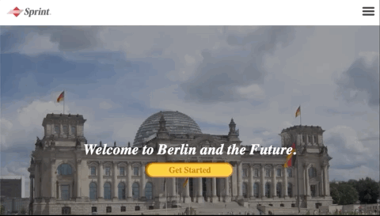

# WELCOME TO BERLIN AND THE FUTURE

## Description: 

Initial webpage for a service to welcome companies in Berlin

## Developed using:

- CSS
- HTML
- JavaScript

## Features:

- Initial link for the content of the page on friendly designed page that also presents characteristics of our fictional company.

- Hamburguer Menu developed with JavaScript

- Media Query (Mobile friendly)

